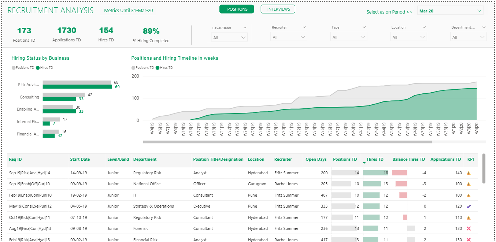
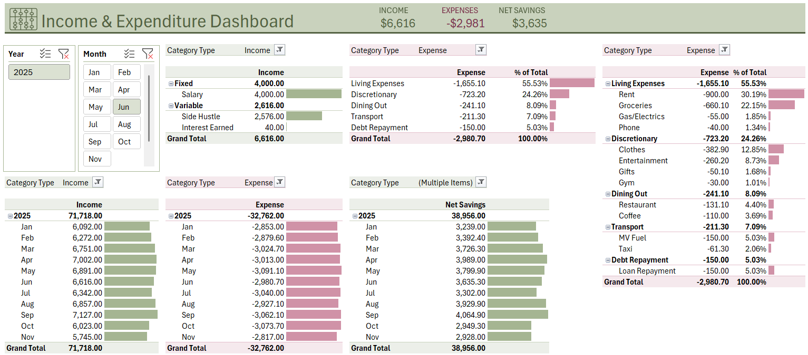

# Sai Kishan Tanguturi – Data Analyst Portfolio

🔗 [LinkedIn](https://www.linkedin.com/in/saikishans) | 📧 kishansaims@gmail.com | 📍 Hyderabad, India

---

## 🧠 About Me

Business-focused **Data Analyst** with over **2 years** of experience transforming raw data into actionable insights to drive strategic decisions. Proficient in **Advanced SQL**, **Power BI**, and **Excel** (Power Query, Pivot, DAX), with a passion for building dashboards, automating reports, and delivering data stories that matter. Skilled in geo-mapping, sentiment tracking, and campaign optimization. Looking to collaborate on impactful data-driven projects.

---

## 🛠️ Skills

- **Languages & Frameworks**: SQL (Joins, CTEs, Subqueries, Window Functions), Python (Pandas, NumPy)
- **Databases & Tools**: PostgreSQL, Microsoft Excel, Google Sheets
- **Visualization Tools**: Power BI, Excel Dashboards, DAX Studio
- **Data Tasks**: ETL, Data Cleaning, Validation, Normalization, Pipelines
- **Soft Skills**: Stakeholder Communication, Team Leadership, Problem Solving, Attention to Detail

---
## 📁 Portfolio Projects

### 🧑‍💼 Recruitment Analytics Dashboard – Power BI

Built a **Power BI dashboard** to visualize the end-to-end recruitment funnel using Excel-based candidate data. The report highlights drop-off stages, role/location-wise trends, and turnaround time (TAT), empowering HR teams to make data-driven hiring decisions.

**🔧 Tools Used**: Power BI, Power Query, DAX, Excel  
**📊 Key Insights**: Dropout analysis, role-based performance, location trends, and recruitment KPIs  
**🔗 [View Project Repository](link-to-repo)**

---

### ✈️ Indigo Flight Dashboard – Excel BI Project

Developed an **interactive Excel dashboard** to analyze Indigo Airlines flight performance using PivotTables, slicers, and VBA. The dashboard tracks revenue, punctuality, route performance, and monthly trends for airline operations.

**🔧 Tools Used**: Excel, PivotTables, Slicers, VBA, Conditional Formatting  
**📊 Key Insights**: Top revenue routes, most delayed sectors, monthly and route-wise trends  
**🔗 [View Project Repository](link-to-repo)**

---

### 💰 Personal Finance Tracker – Excel Dashboard

Created a **fully automated personal finance tracker in Excel** to log, categorize, and visualize income and expenses. Built-in formulas and pivot tables power a dynamic dashboard that supports monthly budgeting and financial planning.

**🔧 Tools Used**: Excel, Lookup Functions, Pivot Tables, Conditional Formatting  
**📊 Key Insights**: Income vs. expense trends, top spending categories, savings tracker  
**🔗 [View Project Repository](link-to-repo)**

---

## 🎓 Education

### 🎓 Halmstad University – Sweden  
**CISCO Network Design and Computer Management**  
*Sep 2018 – Feb 2019*  
- Focused on scalable infrastructure, automation using Python, and Linux system administration.

### 🎓 Dalarna University – Sweden  
**Master’s in Solar Energy Engineering**  
*Sep 2015 – Aug 2018*  
- Specialized in renewable energy systems and analytical modeling using TRNSYS & Polysun.  
- Thesis: *Data modeling of solar output variance due to connector differences*.

---

## 📫 Let's Connect

- 📧 Email: kishansaims@gmail.com  
- 💼 [LinkedIn](https://www.linkedin.com/in/saikishans)  
- 🌐 Location: Hyderabad, India  

---

> _“Data beats opinion.” – Jeff Weiner_
